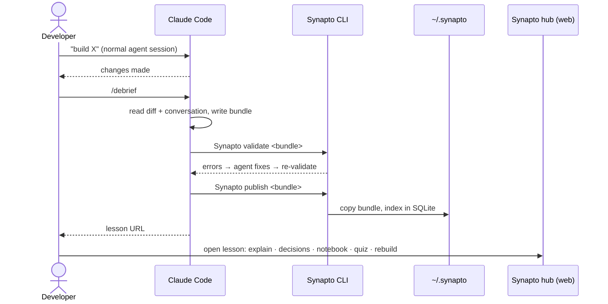
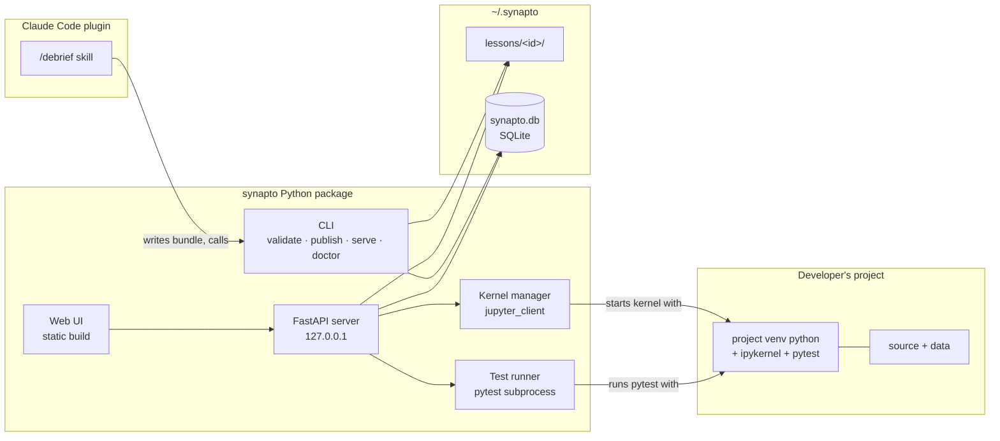

# Synapto — specification

> Working name. Check PyPI/GitHub for collisions before the first release.

- **Status:** Draft v0.1
- **Date:** 2026-10-03
- **Scope:** Python projects, Claude Code, single local user, open source

## 1. Problem

Coding agents now write meaningful chunks of a codebase. Developers accept those changes without understanding them, or they skip past the architectural choices the agent made. Over time the developer owns code they can't explain, debug or defend.

## 2. What Synapto is

Synapto is a local learning hub. Right after an agent has built something, the developer runs `/debrief` in Claude Code. The agent then produces an interactive lesson about exactly what it just built and publishes it to a website running on the developer's machine. On that website the developer can:

- read a clear explanation with diagrams,
- review the architectural decisions and the alternatives that were rejected,
- run and modify the built code, dissected into functions, in a notebook that uses the project's real environment and (optionally) real data,
- take a quiz,
- rebuild key functions from a stub until the tests pass.

Synapto also teaches choices *before* anything is built ([ADR-0008](adr/0008-decision-lessons.md)). With `/decide "<question>"` (for example "which database fits this project?") the agent researches the best candidates and publishes a **decision lesson**: the problem space, the candidates compared on criteria that matter for this project, and a quiz. In **guided** mode the lesson leads to the agent's recommendation. In **open** mode the developer makes the choice and writes down why. Then `/decide review` has the agent challenge that reasoning and give its own opinion, which it wrote down before the developer chose.

### Goals

- A lesson is generated with one command, after the build, from the actual diff and conversation.
- Every lesson is validated before it is published: all notebook cells run and all exercises are gradeable.
- Code runs in the project's own Python environment, so real dependencies and real data work.
- Installation is a single command (`pipx install synapto-hub`) plus a Claude Code plugin.

### Non-goals (v1)

- Languages other than Python.
- Multiple users, authentication or hosting for teams.
- Agent harnesses other than Claude Code. The design keeps this possible: the skill only writes files and calls the CLI.
- Sandboxing. Synapto runs your own code on your own machine with your permissions (see §11).

## 3. User flow



## 4. Architecture



Repository layout:

```
synapto/
├── .claude-plugin/marketplace.json  # plugin marketplace for this repo
├── plugin/                    # Claude Code plugin "synapto"
│   ├── .claude-plugin/plugin.json
│   └── skills/debrief/SKILL.md
├── src/synapto/
│   ├── cli.py
│   ├── bundle/                # schema models (pydantic), loader, validator
│   ├── server/                # FastAPI app, routes, kernel manager, test runner
│   ├── store.py               # lesson store + SQLite
│   └── web/                   # built frontend assets (generated, shipped in wheel)
├── web/                       # frontend source
├── docs/
│   ├── spec.md
│   └── adr/
└── tests/
```

Decisions behind this design: [ADR-0001](adr/0001-execute-code-in-project-venv-kernel.md) (execution), [ADR-0002](adr/0002-notebook-as-ipynb.md) (notebook format), [ADR-0003](adr/0003-central-lesson-store.md) (lesson storage), [ADR-0004](adr/0004-grade-exercises-with-pytest.md) (grading), [ADR-0005](adr/0005-frontend-react-vite.md) (frontend).

## 5. Lesson bundle format

The bundle is the contract between the skill and the hub. Nothing else crosses that boundary.

A lesson has one or more **parts**, chosen by the developer at `/debrief` time and listed in `lesson.json` `parts` ([ADR-0007](adr/0007-choose-lesson-parts-at-debrief.md)). Each part has its own file, which is required when the part is listed and an error when it isn't:

| part | file |
|---|---|
| `explain` | `explanation.md` |
| `decisions` | `decisions.md` |
| `notebook` | `notebook.ipynb` (plus `fixtures/` for its data slots) |
| `quiz` | `quiz.json` |
| `rebuild` | `exercises/` |
| `options` | `options.json` (decision lessons only, §5.7) |

```
<lesson-id>/
├── lesson.json            # always: metadata, parts, source, environment, data slots
├── explanation.md         # explain: narrative, Mermaid blocks allowed
├── decisions.md           # decisions: architectural decisions (may say "none")
├── diagrams/              # optional: .mmd or .svg referenced from markdown
├── notebook.ipynb         # notebook: dissected, runnable code
├── fixtures/              # optional: small sample inputs (≤ 5 MB total)
├── quiz.json              # quiz: 5–10 questions
└── exercises/             # rebuild: 1–3 exercises
    └── 01-<slug>/
        ├── exercise.json
        ├── stub.py
        ├── solution.py
        └── test_exercise.py
```

**Lesson id:** `YYYY-MM-DD-<kebab-slug>`. If the id already exists, add a suffix (`-2`).

### 5.1 `lesson.json`

```json
{
  "schema_version": 1,
  "id": "2026-10-03-octree-voxel-downsampling",
  "title": "Voxel downsampling with an octree",
  "summary": "One or two sentences on what was built and why.",
  "created_at": "2026-10-03T11:20:00+02:00",
  "difficulty": "intermediate",
  "concepts": ["octree", "spatial hashing", "numpy vectorisation"],
  "prerequisites": ["numpy broadcasting"],
  "parts": ["explain", "decisions", "notebook", "quiz", "rebuild"],
  "source": {
    "repo_path": "/home/me/code/pointtools",
    "remote": "https://github.com/me/pointtools",
    "branch": "feat/downsample",
    "base_commit": "a1b2c3d",
    "head_commit": "e4f5a6b",
    "includes_uncommitted": false,
    "files": [
      { "path": "src/pointtools/downsample.py", "sha256": "…" }
    ]
  },
  "environment": {
    "python": "/home/me/code/pointtools/.venv/bin/python",
    "python_version": "3.12.4",
    "cwd": "/home/me/code/pointtools",
    "extra_sys_path": ["src"]
  },
  "data_slots": [
    {
      "name": "input_las",
      "kind": "file",
      "description": "A LAS/LAZ point cloud to downsample.",
      "default": "fixtures/sample_1k.las",
      "required": false
    }
  ]
}
```

- `parts` is optional and defaults to all five. It must not be empty or repeat a part.
- `kind` is `debrief` (the default) or `decision`. A decision lesson also has `question` (the developer's question, in their words) and `mode` (`guided` or `open`), and its `parts` holds `options` plus optionally `explain` and `quiz`; its default is `["explain", "options", "quiz"]`. A debrief lesson can't have `question`, `mode` or the `options` part.
- `source` is required for a debrief lesson. A decision lesson may leave it out (there may be no repo yet); when it's given, `source.files` may be empty.
- `environment` is required only when `parts` has `notebook` or `rebuild`.
- `source.files[].sha256` lets the hub show a "code has changed since this lesson" banner when the repo has moved on.
- `data_slots[].kind` is one of `file`, `dir`, `string` or `number`. A `default` must point inside the bundle (a fixture) or be a literal value.
- `difficulty` is one of `beginner`, `intermediate` or `advanced`. `created_at` must include a timezone. `environment.python`, `environment.cwd` and `source.repo_path` are absolute paths; `source.files[].path` and `extra_sys_path` entries are relative.
- Unknown fields are errors in every JSON file, so a misspelt key is caught rather than ignored.

### 5.2 `explanation.md`

GitHub-flavoured Markdown. Mermaid in ```` ```mermaid ```` fences, which the hub renders client-side. SVGs are referenced as ``. Recommended structure, which the skill follows:

1. **What was built**: one paragraph, in plain terms.
2. **The problem it solves**: before any code.
3. **How it works**: concepts first, then a walk-through of the main path, with at least one diagram.
4. **How it fits in the codebase**: callers, data flow, files touched.
5. **Things to watch**: edge cases, performance, known limitations.

Code references use `path:line-range` anchors, e.g. `src/pointtools/downsample.py:40-72`. The hub links these to the notebook cell with the same `source_ref`.

### 5.3 `decisions.md`

One section per architectural decision the agent made while building:

```markdown
## <Decision title>

**Context:** why a choice was needed.
**Options:** A — …; B — …; (C — …)
**Chosen:** B
**Why:** tied to this project's constraints.
**Trade-offs:** what this costs, and what would change the choice.
**ADR:** docs/adr/0007-….md (if the project has one)
```

If there were no architectural decisions, the file says so in one line. The hub shows a "Revisit" button that copies a prompt to the clipboard ("Reconsider decision X in <repo> …") so the developer can challenge the decision in Claude Code.

### 5.4 `notebook.ipynb`

A standard nbformat 4 notebook, so it renders on GitHub and opens in Jupyter or VS Code. synapto-specific behaviour lives in cell metadata under the `synapto` key:

```json
{
  "synapto": {
    "role": "setup | function | demo | explain",
    "function": "voxel_downsample",
    "source_ref": "src/pointtools/downsample.py:40-72",
    "hidden": false,
    "editable": true
  }
}
```

| role | contains |
|---|---|
| `setup` | imports, loading data slots and fixtures, project helpers imported from the real package |
| `function` | the source of one function from the build, copied verbatim so the learner sees and can edit it |
| `demo` | a call to the function on fixture or real data, printing or plotting intermediate results |
| `explain` | a short markdown cell placed between code cells |

Every cell needs `metadata.synapto.role`. `explain` cells are markdown cells; the other roles are code cells. A `function` cell also needs `function` and `source_ref`, and must contain a top-level `def <function>`.

**Dissection rules:**

- Copy the functions that are the subject of the lesson into `function` cells. Import everything else (helpers, config, models) from the real project.
- Each `function` cell is followed by at least one `demo` cell that shows inputs, outputs and an intermediate value.
- The notebook must run top to bottom in a fresh kernel.

**Data slot injection:** before running any cell, the server executes a hidden preamble:

```python
SYNAPTO_DATA = {"input_las": "/abs/path/chosen/by/user.las"}
SYNAPTO_LESSON_DIR = "/home/me/.synapto/lessons/<id>"
```

Setup cells read from `SYNAPTO_DATA[...]` and never hard-code paths.

### 5.5 `quiz.json`

```json
{
  "questions": [
    {
      "id": "q1",
      "prompt": "Why is the voxel key computed with integer floor division instead of rounding?",
      "options": [
        { "id": "a", "text": "…" },
        { "id": "b", "text": "…" },
        { "id": "c", "text": "…" },
        { "id": "d", "text": "…" }
      ],
      "correct": "b",
      "explanation": "…",
      "concept": "spatial hashing",
      "source_ref": "src/pointtools/downsample.py:51"
    }
  ]
}
```

There are 5–10 questions. They test understanding (why, what happens if, which trade-off) rather than recall of names. Distractors must be plausible misconceptions.

### 5.6 Exercises

`exercise.json`:

```json
{
  "id": "01-voxel-key",
  "title": "Compute voxel keys",
  "function": "voxel_key",
  "prompt": "Markdown description of what to implement and why it matters.",
  "difficulty": "easy",
  "hints": ["Think about negative coordinates.", "…"],
  "source_ref": "src/pointtools/downsample.py:44-50"
}
```

- The folder name equals `exercise.json`'s `id`. `difficulty` is one of `easy`, `medium` or `hard`.
- `stub.py`: the same signature, type hints and docstring as the original, with the body `raise NotImplementedError`. Imports needed by the solution are kept.
- `solution.py`: the reference implementation, normally identical to the built code.
- `test_exercise.py`: pytest tests that import with `from candidate import <function>`. They cover normal behaviour and at least one edge case taken from the real code's handling.

### 5.7 `options.json`

The `options` part of a decision lesson: the candidates, the criteria they're compared on, and the agent's recommendation.

```json
{
  "criteria": [
    { "id": "ops", "name": "Operational simplicity", "description": "No server to run, back up or upgrade.", "weight": 3 }
  ],
  "options": [
    {
      "id": "sqlite",
      "name": "SQLite",
      "summary": "An embedded, single-file SQL database.",
      "strengths": ["Zero setup", "…"],
      "weaknesses": ["One writer at a time", "…"],
      "fits_when": "A single process writes and the data fits on one machine.",
      "scores": { "ops": 5 },
      "links": [{ "title": "Appropriate uses for SQLite", "url": "https://www.sqlite.org/whentouse.html" }]
    }
  ],
  "recommendation": {
    "option": "sqlite",
    "why": "Markdown, tied to this project's constraints.",
    "trade_offs": "What the choice costs.",
    "would_change_if": "What would make another option the better choice."
  }
}
```

- 2–5 options and 2–8 criteria, each with a unique `id` (lowercase letters, digits and `-`).
- `weight` is 1–3. Every option scores every criterion, 1 (poor) to 5 (excellent), and nothing else.
- `strengths` and `weaknesses` each have at least one entry. `links` is optional.
- `recommendation.option` is one of the option ids. In open mode the hub hides the recommendation until the review is done (§6.1).

## 6. The `/debrief` skill

It ships in `plugin/skills/debrief/SKILL.md`. It takes an optional argument for scope: `/debrief`, `/debrief since a1b2c3d`, `/debrief src/pointtools/downsample.py`, optionally preceded by the parts to make: `/debrief only explain,quiz since a1b2c3d`.

Steps:

1. **Scope.** The default is uncommitted changes plus the commits made during this session. If that's ambiguous (nothing changed, or a huge diff), ask the developer once.
2. **Parts.** Unless the argument names them (`/debrief only explain,quiz`), ask the developer once which parts to make. The default is all five.
3. **Gather.** Read the diff, the touched files in full, and the reasoning from the conversation, including the alternatives that were considered.
4. **Plan.** Pick 3–7 key functions (for the notebook and rebuild parts), the concepts a learner needs and the decisions made. Lessons should be focused: if the build covers several unrelated features, propose separate lessons.
5. **Write** `lesson.json` and the files of the chosen parts, following §5. `explanation.md` has at least one diagram. Generate fixtures with code where possible rather than copying real data.
6. **Validate.** Run `synapto validate <bundle>`. Fix and re-run until it passes, up to 5 attempts. If it still fails, stop and report the remaining errors.
7. **Publish.** Run `synapto publish <bundle>` and give the developer the lesson URL plus a two-line summary.

The bundle is written to a temporary working directory, never into the project repo.

### 6.1 The `/decide` skill

It ships in `plugin/skills/decide/` (`SKILL.md`, with `decision-format.md` and `review.md`). `/decide [guided|open] "<question>" [candidate…]` makes a decision lesson; `/decide review <id>` reviews an open decision.

Making a lesson:

1. **Question.** Restate the question and the project context it depends on (scale, team, existing stack, constraints), read from the repo and the conversation. If it is too vague to pick criteria, ask the developer once.
2. **Mode.** Unless the argument names it, ask whether the developer wants a recommendation (`guided`) or to decide themselves (`open`).
3. **Candidates.** Start from the candidates the developer named, if any. Add the strongest alternatives they missed and drop ones that can't fit, saying why. Keep 2–5.
4. **Research.** Check current facts (versions, licences, limits) against primary sources. Link them in `links`.
5. **Write** `lesson.json`, `options.json` and the chosen parts. Write the recommendation now, in both modes, before the developer has chosen. In open mode, `explanation.md` and the quiz must not give the recommendation away.
6. **Validate** and **publish** as in `/debrief`.

Reviewing (`/decide review <id>`):

1. Run `synapto decision show <id>`. If the developer hasn't recorded a choice yet, tell them to do it in the hub and stop.
2. Challenge the choice in the terminal: 2–4 questions aimed at the weakest points of *their* reasoning, one at a time. Name a better option only after they've answered. There is no wrong choice; the point is that they can defend it.
3. Write the verdict and store it with `synapto decision verdict <id> <file>`:

   ```json
   {
     "final_option": "postgres",
     "challenges": [{ "question": "…", "response": "A one-line summary of the developer's answer." }],
     "opinion": "Markdown: the agent's view of the developer's choice and reasoning."
   }
   ```

   `final_option` is the option the developer settles on, which may differ from their recorded choice. The hub compares it with the recommendation itself.
4. Offer to record the decision as an ADR in the project. If the developer accepts, write it and run `synapto decision verdict <id> <file> --adr <path>` to link it.

## 7. CLI

| command | does |
|---|---|
| `synapto serve [--port 8765] [--open] [--reload]` | starts the hub on `127.0.0.1`. `--reload` first stops the hub already running on that port |
| `synapto validate <bundle>` | runs all checks in §8 and prints errors as `file:location: message`. Exit code 0 means valid |
| `synapto publish <bundle> [--force]` | validates, copies to the store and indexes it. Fails if the id exists, unless `--force` |
| `synapto list [--repo PATH]` | lists lessons |
| `synapto open <id>` | opens the lesson in the browser, starting `serve` if needed |
| `synapto doctor [--python PATH]` | checks that the project interpreter has `ipykernel` and `pytest` and prints the fix command |
| `synapto remove <id> [--yes]` | deletes a lesson and its progress, after asking for confirmation |
| `synapto decision show <id>` | prints a decision lesson's question, mode, options, recommendation, the developer's choice and any verdict as JSON, for `/decide review` |
| `synapto decision verdict <id> <file> [--adr PATH]` | validates and stores a review verdict (§6.1). Fails if the developer hasn't chosen yet |

The store location is `~/.synapto`. It can be overridden with `SYNAPTO_HOME`.

## 8. Validation

`synapto validate` fails on any of the following:

- **Schema:** `lesson.json`, `quiz.json` or any `exercise.json` doesn't match the pydantic models.
- **Parts:** the file of a part listed in `parts` is missing, or the file of an unlisted part is present. Only the listed parts are checked.
- **Environment:** `environment.python` doesn't exist, or lacks `ipykernel` or `pytest`. Checked only when the lesson has a notebook or rebuild part.
- **Notebook:** it doesn't execute top to bottom in a fresh kernel (with the default data slots), any cell errors, or a `function` cell has no following `demo` cell.
- **Exercises:** the tests fail against `solution.py`, or the tests **pass** against `stub.py`. The second check guarantees the tests actually check something.
- **Quiz:** `correct` doesn't match an option id, there are fewer than 3 options, or an explanation is empty.
- **References:** a `source_ref` points to a file not listed in `source.files`, or a `diagrams/` file referenced in Markdown is missing.
- **Size:** `fixtures/` is over 5 MB.

Also checked, because they make errors easier to act on:

- **Exercises (static):** the folder count is 1–3; each has all four files; `stub.py` and `solution.py` define `function` with identical signatures; `test_exercise.py` imports from `candidate`; `stub.py` is importable when the tests run.
- **Data slots:** a `file` or `dir` default exists in the bundle.
- **Markdown:** `explanation.md` and `decisions.md` aren't empty.
- **Decision lessons:** `options.json` matches §5.7, and `parts` holds only `explain`, `options` and `quiz`.

Warnings (they don't fail validation): a Mermaid block fails to parse (checked if `mmdc` is installed), a cell takes more than 30 seconds to run, or a single test passes against `stub.py` (while others fail).

The validator reports every issue it can find in one run. Cells run in order and execution stops at the first failing cell. The notebook and exercises run only when `lesson.json` is valid and its environment is usable; otherwise the CLI says they were skipped.

## 9. Server

FastAPI, served by uvicorn and bound to `127.0.0.1` only. It also serves the built frontend.

### 9.1 HTTP API

| method | path | purpose |
|---|---|---|
| GET | `/api/lessons` | list, with filters `repo` and `concept` |
| GET | `/api/lessons/{id}` | `lesson.json` plus progress, staleness and the latest quiz answers; records that the lesson was opened |
| DELETE | `/api/lessons/{id}` | deletes the lesson, its progress and its kernel, like `synapto remove` |
| GET | `/api/lessons/{id}/decisions` | `decisions.md` parsed into one record per decision (§5.3), with the raw Markdown kept for sections that don't follow the template |
| GET | `/api/lessons/{id}/files/{path}` | raw bundle files (markdown, svg, fixtures) |
| GET / PUT | `/api/lessons/{id}/notebook` | the learner's working copy. GET falls back to the original |
| POST | `/api/lessons/{id}/notebook/reset` | discards the working copy |
| GET / PUT | `/api/lessons/{id}/data-slots` | data slot values chosen by the learner |
| POST | `/api/lessons/{id}/kernel` | starts (or returns) the lesson's kernel and runs the preamble |
| POST | `/api/lessons/{id}/kernel/restart` | restarts the kernel |
| DELETE | `/api/lessons/{id}/kernel` | shuts the kernel down |
| WS | `/api/lessons/{id}/kernel/ws` | execute requests in, streamed outputs out (stdout, display_data, errors) |
| POST | `/api/lessons/{id}/quiz/{qid}/answer` | records an answer and returns correct or wrong plus the explanation |
| GET | `/api/lessons/{id}/exercises` | each exercise's `exercise.json`, `stub.py`, past runs (the attempt count) and whether it has passed |
| POST | `/api/lessons/{id}/exercises/{eid}/run` | body `{code}` → per-test results; records the run and keeps the code as the draft |
| GET / PUT | `/api/lessons/{id}/exercises/{eid}/draft` | the learner's in-progress code. GET falls back to `stub.py` |
| GET | `/api/lessons/{id}/decision` | a decision lesson's question, mode, criteria, options, recommendation, choice and review. In open mode `recommendation` is `null` until the review is done |
| PUT | `/api/lessons/{id}/choice` | records the developer's choice in an open decision lesson, body `{option_id, reasoning}`. Returns 409 for a guided lesson, an unknown option, empty reasoning, or once the review is done |
| GET | `/api/progress` | totals across lessons and concepts |
| POST | `/api/shutdown` | stops the server; used by `synapto serve --reload` |

### 9.2 Kernel manager

- Uses `jupyter_client.AsyncKernelManager` with `kernel_cmd = [<environment.python>, "-m", "ipykernel_launcher", "-f", "{connection_file}"]`.
- The working directory is `environment.cwd`. `environment.extra_sys_path` and the bundle directory are prepended to `sys.path` in the preamble.
- There is one kernel per open lesson. Idle kernels shut down after 30 minutes. At most 3 kernels run at once, and the least recently used is evicted first.
- WebSocket messages are a thin translation of Jupyter `execute_request` and iopub messages into a small JSON protocol. In: `{type: "execute", id, code}` and `{type: "interrupt"}`. Out, tagged with the request's `id`: `{type: "kernel", session}` first, then `"stream" | "display" | "error" | "clear" | "status"` events, and always `{type: "done", status}` last. A new `session` means a fresh kernel (restart, idle shutdown or eviction). Requests run one at a time; a socket request starts the kernel if it isn't running.

### 9.3 Test runner

For each exercise run:

1. Create a temp dir. Write the learner's code to `candidate.py` and copy `test_exercise.py` there.
2. Run `<environment.python> -m pytest -q --junitxml=report.xml` with `cwd=temp`, `PYTHONPATH=<environment.cwd>/<extra_sys_path>`, and a 60-second timeout. JUnit XML avoids requiring an extra pytest plugin in the project venv.
3. Return each test's name, status and a trimmed failure message.

## 10. Storage

```
~/.synapto/
├── config.toml
├── synapto.db
└── lessons/<id>/          # published bundles; never modified after publish
```

SQLite tables:

- `lessons(id, title, repo_path, created_at, concepts_json, difficulty)`, an index over the bundles
- `quiz_answers(lesson_id, question_id, option_id, correct, answered_at)`
- `exercise_runs(lesson_id, exercise_id, code, passed, n_passed, n_total, ran_at)`
- `exercise_drafts(lesson_id, exercise_id, code, updated_at)`
- `notebook_copies(lesson_id, ipynb_json, updated_at)`
- `data_slot_values(lesson_id, slot, value)`
- `lesson_status(lesson_id, opened_at, completed_at)`
- `decision_choices(lesson_id, option_id, reasoning, decided_at)`
- `decision_verdicts(lesson_id, verdict_json, adr_path, reviewed_at)`

Published bundles are immutable. Everything the learner changes lives in SQLite, so "reset" is always possible.

## 11. Security model

- Synapto executes code from lessons with the developer's own permissions, on purpose. Lessons are generated from the developer's own projects.
- The server binds to `127.0.0.1` only. There is no option to bind elsewhere in v1.
- Because the kernel socket runs code, the server answers only requests whose `Host` is `127.0.0.1` or `localhost` (against DNS rebinding), and refuses WebSockets and non-GET requests whose `Origin` is another site (against cross-site requests from pages open in the browser).
- When importing a bundle that wasn't generated locally (a future feature), show a clear warning that it will run that code.

## 12. Web UI

Pages:

- **Library:** lesson cards grouped by repo, with concept filters, progress rings and a staleness badge. Decision lessons carry a "Decision" badge, and those without a repo are grouped under "Not yet built".
- **Lesson**, with a tab for each of its parts and a "Delete lesson" button (with confirmation). A lesson without a quiz or exercises shows no progress. In an open decision lesson, the review counts as one more item to complete.
  - **Explain:** rendered Markdown and Mermaid. Code references link to notebook cells.
  - **Decisions:** one card per decision, each with a "Revisit" button.
  - **Notebook:** cells with run, run-all, restart and reset buttons; a data slot panel with file path inputs; and rich outputs (text, tables, images and Plotly where present).
  - **Quiz:** one question at a time, with an explanation after each answer and a score at the end.
  - **Options:** the question, a criteria × options matrix (weights and scores), and a card per option with strengths, weaknesses, when it fits and links. In guided mode the recommendation is shown at the top. In open mode there is a "Your decision" panel instead: pick an option and write why (required). After saving, it shows the command `/decide review <id>` with a copy button. Once a verdict exists, it shows the challenges, the agent's opinion and the recommendation next to the developer's choice, plus the ADR link if there is one.
  - **Rebuild:** the exercise prompt, hints revealed one by one, an editor preloaded with `stub.py`, a "Run tests" button, per-test results, and a "Show solution" button that becomes available after 3 attempts.

Frontend stack: a React + Vite + TypeScript single-page app ([ADR-0005](adr/0005-frontend-react-vite.md)), built into `src/synapto/web/`.

## 13. Milestones

| # | milestone | done when |
|---|---|---|
| M0 | Bundle models and `synapto validate` | a hand-written example bundle validates, and broken variants fail with clear errors |
| M1 | `/debrief` skill plus `publish` | the skill produces a passing bundle for a real build in one of your repos |
| M2 | Server and read-only UI | Library, Explain, Decisions and Quiz work |
| M3 | Notebook execution | kernel in the project venv, data slots, working copy and reset |
| M4 | Rebuild | exercises graded through pytest, with drafts and progress |
| M5 | Release | pipx-installable wheel with the frontend bundled, the plugin published, a README with a GIF |

The skill and the validator come first because the bundle is the contract. Once the agent reliably produces valid bundles, the hub is ordinary web work.

## 14. Open decisions

These need ADRs before the milestone that depends on them:

- **Lesson updates**: when the code changes, should `/debrief` regenerate a lesson as a new version or as a new lesson?
- **Cross-lesson concept tracking**: build a concept graph from `concepts` across lessons (post-v1).
