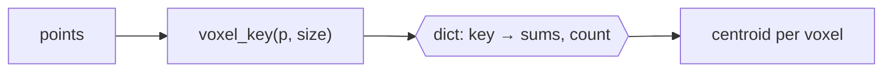
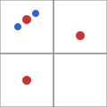

# Voxel downsampling

## What was built

`gridsnap.snap.downsample` thins a point cloud: it lays a grid of cubes ("voxels") over the
points and replaces all the points inside each cube by their average.

## The problem it solves

Scans often hold far more points than an algorithm needs, and the density is uneven: surfaces
close to the scanner are oversampled. Keeping one point per voxel gives a cloud with a bounded,
roughly even density, which makes later steps faster and less biased toward dense regions.

## How it works

Every point gets an integer **voxel key**: its coordinates divided by the voxel size, rounded
**down** (`src/gridsnap/snap.py:24-33`). Points with the same key share a voxel. A dict keyed by
voxel accumulates the coordinate sums and a count, and the centroid of each voxel is the output
(`src/gridsnap/snap.py:36-45`).

## How it fits in the codebase

`read_xyz` loads a cloud from disk, `downsample` is the only public entry point that changes
data, and nothing else in the package depends on it yet.

## Things to watch

- `math.floor`, not `int()`: `int(-0.5)` is `0`, which would merge two voxels around the origin.
- The output keeps the order in which voxels were first seen (dicts keep insertion order).
- A voxel size of zero or less raises `ValueError` instead of dividing by zero.
