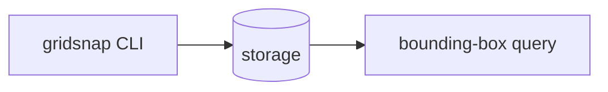

# Storing point clouds

gridsnap needs somewhere to keep downsampled clouds and a way to fetch the points inside a bounding box.

## What matters here

A bounding-box query is fast only with a **spatial index**; without one, every query scans every point.
